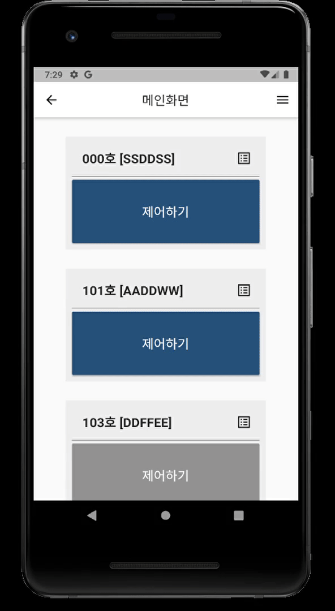
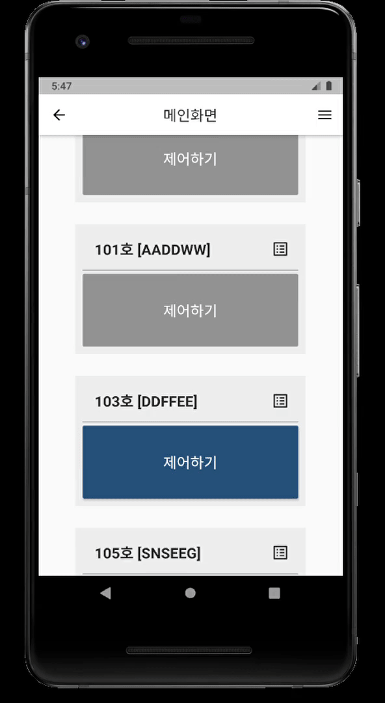

# 출입관제 모바일 앱

|모듈|기능|파일|
|---|---|---|
| 사용자 가입 모듈 | 사용자 로그인 | [loginpage.dart](lib/screens/loginpage.dart)|
| | 사용자 가입 | [reguser.dart](lib/user/reguser.dart)|
| | 사용자 정보변경 | [moduser.dart](lib/user/moduser.dart)|
| 도어락 등록 모듈 | 블루투스 연결 | [blelist.dart](lib/ble/blelist.dart)|
| | 도어락 등록 | [regdoor.dart](lib/door/regdoor.dart)|
| | 도어락 정보변경 | [moddoor.dart](lib/door/moddoor.dart)|
| 도어락 관리 모듈 | 도어락 관리 | [admindoor.dart](lib/admin/admindoor.dart)|
| 사용자 관리 모듈 | 사용자 관리 | [adminuser.dart](lib/admin/adminuser.dart)|
| 도어락 제어 모듈 | 도어락 열람(메인 화면) | [mainpage.dart](lib/screens/mainpage.dart)|
| | 도어락 제어 | [control.dart](lib/door/controldoor.dart)|
| | 도어락 제어내역 | [list.dart](lib/door/controllist.dart)|

## 구현 화면
|||||
|:---:|:---:|:---:|:---:|
|사용자 가입|사용자 정보변경, 탈퇴|도어락 열람, 제어, 제어내역|도어락 관리, 사용자 관리|

